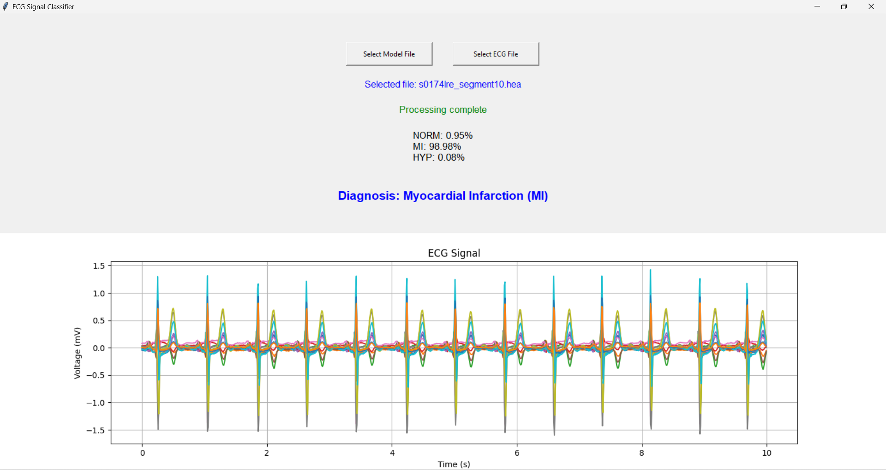

# ECG Signal Classifier

This is a desktop application for classifying ECG signals using a pre-trained deep learning model. The application allows users to load an ECG signal in WFDB format, '.dat' and '.hea' files, process it, and predict the signal's class.

## Features

- Load and use a pre-trained TensorFlow model for ECG signal classification.
- Read and process 10 seconds or more duration ECG signal files in WFDB format.
- Resample ECG signals to 100 Hz.
- Detect R-peak points in the signal.
- Generate signal windows and R-peak masks.
- Display the processed ECG signal.
- Provide class predictions with percentages and a final diagnosis.

## Requirements

Ensure you have the following dependencies installed:

- tensorflow==2.15.0
- wfdb==4.1.2
- numpy==1.26.4
- scipy==1.13.1
- biosppy==2.2.2
- matplotlib==3.9.0

You can install the required packages using the following command:

```bash
pip install -r requirements.txt
```

You can run the application with the following command:

```bash
python ecg_classifier.py
```

## Screenshots

### Start Screen


### Model Loaded


### Normal Diagnosis


### Myocardial Infarction Diagnosis


### Hypertrophy Diagnosis


## Usage

1. **Select Model File**: Click the "Select Model File" button to choose a pre-trained model file (.h5 format).
2. **Select ECG File**: After the model is loaded, click the "Select ECG File" button to choose an ECG signal file (.hea format).
3. **Processing**: The application will read, process, and resample the ECG signal, detect R-peak points, generate windows, and predict the signal class.
4. **View Results**: The processed ECG signal will be plotted in the main window. Prediction results and the final diagnosis will be displayed.

## Test Data

The `test_data` folder contains sample ECG signals organized into three subfolders:

- `HYP`: Contains 5 example signals of Hypertrophy.
- `MI`: Contains 10 example signals of Myocardial Infarction.
- `NORM`: Contains 10 example signals of normal (healthy) ECGs.

These sample data were obtained from the following datasets during preprocessing:

- PTB-XL 1.0.3: [PTB-XL Database](https://physionet.org/content/ptb-xl/1.0.3/)
- PTB: [PTB Diagnostic ECG Database](https://physionet.org/content/ptbdb/1.0.0/)
- St Petersburg INCART 12-lead Arrhythmia Database: [St. Petersburg INCART Database](https://physionet.org/content/incartdb/1.0.0/)

## Application Steps

1. **Model Loading**
   - The application allows users to select a pre-trained model file (.h5 format) using a file dialog.
   - Upon successful loading of the model, a status message will be displayed indicating that the model has been loaded.
   - If the model file fails to load, an error message will be displayed.

2. **ECG File Processing**
   - The application allows users to select an ECG signal file (.hea format) using a file dialog.
   - The selected ECG file's name will be displayed.
   - The application will read the ECG signal using the wfdb library.
   - If the signal duration is less than 10 seconds, an error message will be displayed.
   - If the signal duration is more than 10 seconds, the signal will be truncated to the first 10 seconds.

3. **Signal Processing**
   - Resample the ECG signal to 100 Hz if necessary, using the scipy library.
   - Detect R-peak points in the signal using the biosppy library.
   - Generate windows and R-peak masks from the processed signal.

4. **Model Prediction**
   - Use the loaded model to predict the classification of the ECG signal based on the generated windows and R-peak masks.
   - Display the prediction results with percentages for each class.
   - Highlight the predicted class with a clear diagnosis message.

5. **Signal Plotting**
   - Plot the processed ECG signal in the main window using Matplotlib.
   - Ensure the plot updates dynamically based on the selected signal.

## License

This project is licensed under the MIT License.

## Acknowledgments

- [WFDB Toolbox](https://physionet.org/about/wfdb/)
- [Biosppy Library](https://github.com/PIA-Group/BioSPPy)

## Contact

For any inquiries or support, please contact [e.emreguven@outlook.com].
